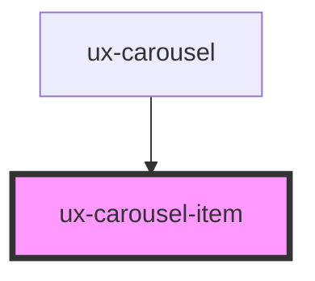

# ux-carousel-item

<!-- Auto Generated Below -->

## Properties

| Property           | Attribute            | Description | Type     | Default     |
| ------------------ | -------------------- | ----------- | -------- | ----------- |
| `dataButtonHref`   | `data-button-href`   |             | `string` | `undefined` |
| `dataButtonLabel`  | `data-button-label`  |             | `string` | `undefined` |
| `dataDescription`  | `data-description`   |             | `string` | `undefined` |
| `dataDesktopImage` | `data-desktop-image` |             | `string` | `undefined` |
| `dataMobileImage`  | `data-mobile-image`  |             | `string` | `undefined` |
| `dataTitle`        | `data-title`         |             | `string` | `undefined` |

## Dependencies

### Used by

 - [ux-carousel](../ux-carousel)

### Graph

----------------------------------------------

*Built with [StencilJS](https://stenciljs.com/)*
