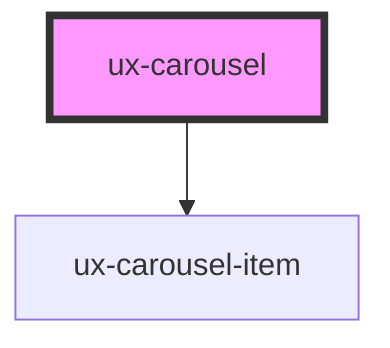

# ux-carousel

<!-- Auto Generated Below -->

## Properties

| Property         | Attribute         | Description | Type      | Default     |
| ---------------- | ----------------- | ----------- | --------- | ----------- |
| `dataArrows`     | `data-arrows`     |             | `boolean` | `undefined` |
| `dataAutoplay`   | `data-autoplay`   |             | `boolean` | `undefined` |
| `dataItems`      | `data-items`      |             | `string`  | `undefined` |
| `dataPagination` | `data-pagination` |             | `boolean` | `undefined` |
| `dataRewind`     | `data-rewind`     |             | `boolean` | `undefined` |

## Dependencies

### Depends on

- [ux-carousel-item](../ux-carousel-item)

### Graph

----------------------------------------------

*Built with [StencilJS](https://stenciljs.com/)*
