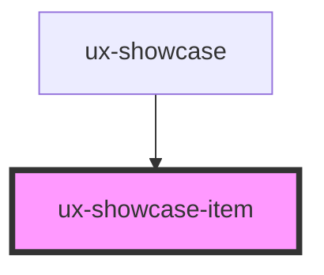

# ux-showcase-item

<!-- Auto Generated Below -->

## Properties

| Property           | Attribute            | Description | Type      | Default     |
| ------------------ | -------------------- | ----------- | --------- | ----------- |
| `dataHasInterest`  | `data-has-interest`  |             | `boolean` | `undefined` |
| `dataHref`         | `data-href`          |             | `string`  | `undefined` |
| `dataImage`        | `data-image`         |             | `string`  | `undefined` |
| `dataName`         | `data-name`          |             | `string`  | `undefined` |
| `dataParcelPrice`  | `data-parcel-price`  |             | `number`  | `undefined` |
| `dataParcels`      | `data-parcels`       |             | `number`  | `undefined` |
| `dataPrice`        | `data-price`         |             | `number`  | `undefined` |
| `dataPriceCompare` | `data-price-compare` |             | `number`  | `undefined` |

## Dependencies

### Used by

 - [ux-showcase](../ux-showcase)

### Graph

----------------------------------------------

*Built with [StencilJS](https://stenciljs.com/)*
