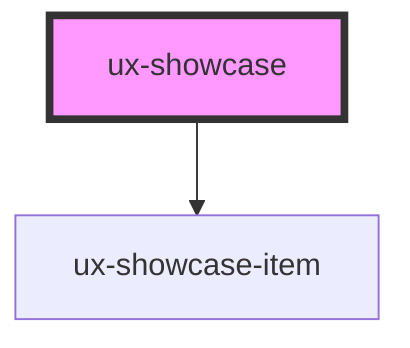

# ux-showcase

<!-- Auto Generated Below -->

## Properties

| Property     | Attribute     | Description | Type     | Default     |
| ------------ | ------------- | ----------- | -------- | ----------- |
| `dataImages` | `data-images` |             | `string` | `undefined` |

## Dependencies

### Depends on

- [ux-showcase-item](../ux-showcase-item)

### Graph

----------------------------------------------

*Built with [StencilJS](https://stenciljs.com/)*
